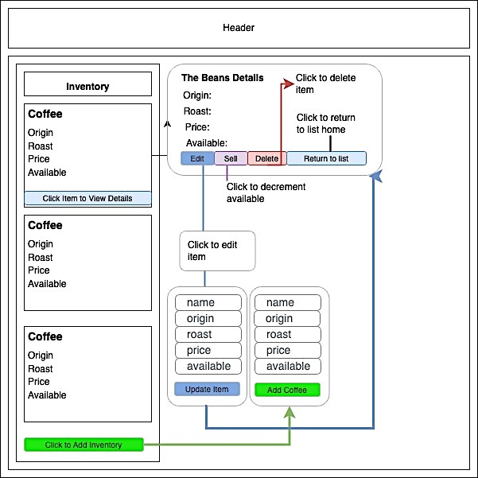

# Inventory Tracker

#### By _**Eusebie Siebenberg**_

#### Coffee Shop inventory tracker application built with React

## Technologies Used

* React
* Nodejs
* Webpack
* Node.js
* JSX
* Javascript

#### Initial Mockup designed in draw.io [drawio.com](https://www.drawio.com/)

## Description

At our coffee shop, we sell coffee beans in 1-pound servings, and we get our coffee delivered in large burlap sacks. Here are the details:
* we sell multiple types of coffee beans, each in different burlap sacks
* one burlap sack contains 130 pounds of coffee beans
* every sale decrements one pound of coffee beans from the burlap sack, until it is empty
As a user, I want to see a list/menu of all available types of coffee beans. For each item, I want to see its name, origin, price, and roast of the coffee bean. As a user, I want to:
* submit a form to add a new burlap sack of coffee to the inventory
* click on a burlap sack to see its detail page
* see how many pounds of coffee beans are left in a burlap sack. A burlap sack has roughly 130 pounds
* click a button to sell a pound of coffee beans. This should decrease the number of pounds left by 1. The number of pounds in a sack of coffee beans should not be able to go below 0

## Setup/Installation Requirements

## Setup Instructions 
1. Open your terminal (e.g. Terminal of Gitbash) and run these commands:
2. Clone this repo to your desktop using $ `git clone https://github.com/eusebiedev/Inventory-Tracker.git ` 
3. Navigate to this project's root directory `inventory-tracker` with $ `cd inventory-tracker`
4. Run $ `npm install` in the project's root directory to install any necessary dependencies.
5. Run $ `npm start` in the project's root directory to start the server. Once the server loads, user should have full CRUD functionality to interact with the application

## Known Bugs as of 06/30/23

* _No known bugs_

## License

## [MIT](https://opensource.org/license/mit/) License 

Copyright (c) 2023 Eusebie Siebenberg

Permission is hereby granted, free of charge, to any person obtaining a copy
of this software and associated documentation files (the "Software"), to deal
in the Software without restriction, including without limitation the rights
to use, copy, modify, merge, publish, distribute, sublicense, and/or sell
copies of the Software, and to permit persons to whom the Software is
furnished to do so, subject to the following conditions:

The above copyright notice and this permission notice shall be included in all
copies or substantial portions of the Software.

THE SOFTWARE IS PROVIDED "AS IS", WITHOUT WARRANTY OF ANY KIND, EXPRESS OR
IMPLIED, INCLUDING BUT NOT LIMITED TO THE WARRANTIES OF MERCHANTABILITY,
FITNESS FOR A PARTICULAR PURPOSE AND NONINFRINGEMENT. IN NO EVENT SHALL THE
AUTHORS OR COPYRIGHT HOLDERS BE LIABLE FOR ANY CLAIM, DAMAGES OR OTHER
LIABILITY, WHETHER IN AN ACTION OF CONTRACT, TORT OR OTHERWISE, ARISING FROM,
OUT OF OR IN CONNECTION WITH THE SOFTWARE OR THE USE OR OTHER DEALINGS IN THE
SOFTWARE.
If you have any questions, comments, or concerns, please reach out to me at: siebenee@gmail.com